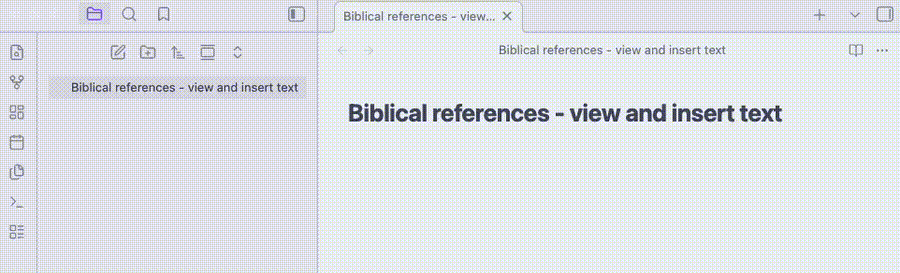

# BibLens

An [Obsidian](https://obsidian.md) plugin that detects Bible references in your notes and shows the verse text as a hover preview — in the editor and in Reading View.

Works fully offline. No external services required.

## Demo




## Features

### Automatic reference detection

BibLens recognises Bible references directly in your Markdown notes.

Examples:

```
John 3:16
Exod 2,15
Isa 6,25-7,3
```

Detected references are underlined in the editor.


### Hover preview

Hovering a reference displays the verse text.

Supported in:

- Reading View
- Live Preview editor

The preview shows the verse number and verse text.

If the verse is not available in the selected translation, the plugin shows:

```
Verse not found
```

### Insert verse text

Command palette command:

```
BibLens: Insert verse text after reference
```

The command finds the last reference before the current position and inserts the verse text after it.

The command:

```
BibLens: Replace previous reference by quote
```

replaces the reference with an Obsidian blockquote containing the verse or passage text.

Example:

```
Mat 1,3
```

becomes

```
> Matt 1,3 — Judah the father of Perez and Zerah by Tamar...
```


## Translations and language packs

BibLens separates **software** from **data**.

The plugin downloads available resources from the BibLens data repository.

Resource types:

- Bible translations
- Language packs (book name aliases)
- Reference formats (abbreviation rules)

Users can install and remove these resources from the plugin settings.


## Settings

The settings panel allows you to configure:

Current settings:

- Translation
- Language pack
- Reference format

Advanced:

- parsing rules

All installed resources can be managed directly from the settings interface.


## Data repository

Available translations and language packs are stored in a separate repository:

https://github.com/marekpola/biblens-data

This allows new translations and language packs to be published without updating the plugin.


## Installation

### Community Plugins (recommended)

1. Open **Settings → Community Plugins**
2. Disable *Safe Mode*
3. Search for **BibLens**
4. Install and enable the plugin

### Manual installation

1. Download the latest release
2. Extract the files to:

```
.obsidian/plugins/biblens
```

3. Reload Obsidian
4. Enable the plugin in Community Plugins

## Support
If BibLens is useful in your research,
consider supporting its development.

☕ https://buymeacoffee.com/marekpola

## License

MIT License

